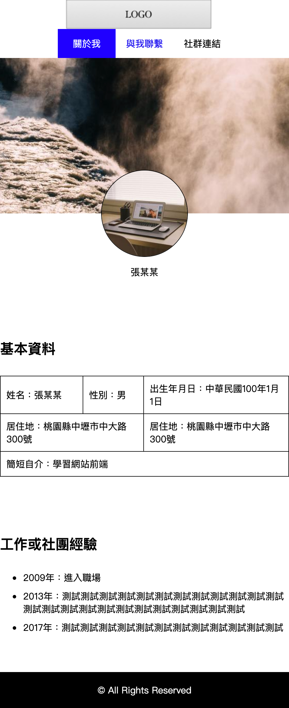

# 3.2.3 媒體查詢與 viewport

## 使用 Media Query 將固定式版型改成 RWD

請[下載這份已經做好的「固定式版型」轉成「響應式版型」的頁面](http://notes.carlos-studio.com/download/rwd_fixed_layout_to_rwd.zip)。

在 767px 以下時，會變成如下圖：



用編輯器開啟 `rwd_fixed_layout_to_rwd` 這個專案資料夾，並開啟 index.html 原始碼：有以下兩個重點

一、在 css 資料夾中有一個 index\_mobile.css 檔案，將這個檔案於 index.html 頁面中載入：

```markup
<link rel="stylesheet" href="./css/index_mobile.css">
```

二、viewport\(暫時註解\)

```markup
<meta name="viewport" content="width=device-width, initial-scale=1.0, user-scalable=yes">
```

接下來請確認可以使用 `http://127.0.0.1` 或 `http://localhost` 等本機端方式來瀏覽頁面。

## 學習使用 ngrok



