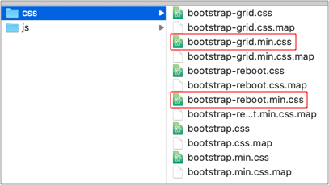

# 4.8 僅載入 Grid 相關 CSS

## 載入資源的檔案大小

### css 部份

全部 Bootstrap 相關的 css：

* bootstrap.min.css → **160kb**

將上述的 `bootstrap.min.css` 拆解出僅剩 `gird` 部份及 `reboot` 部份，按照官方說明，reboot 是從 [Normalize.css](https://necolas.github.io/normalize.css/) 拿過來用，目的在儘可能保持瀏覽器的一致性：

* bootstrap-grid.min.css → **51kb**
* bootstrap-reboot.min.css → **4kb**

\*\*\*\*

### js 部份

* jquery-3.4.1.min.js → **88kb**
* bootstrap.min.js → **60kb**
* popper.min.js → **21kb**

## 比較資源的載入

### 

### 全部載入

bootstrap.min.css\(**160kb**\) + jquery-3.4.1.min.js\(**88kb**\) + bootstrap.min.js\(**60kb**\) + popper.min.js\(**21kb**\) = **329kb**

### 

### 僅載入 Grid System 相關

bootstrap-grid.min.css\(**51kb**\) + bootstrap-reboot.min.css\(**4kb**\) = **55kb** 。\(省很多資源\)。

如果常用 jQuery\(**88kb**\)，再加上去，也只有 **143kb** 。\(也有省超過一半的資源\)

