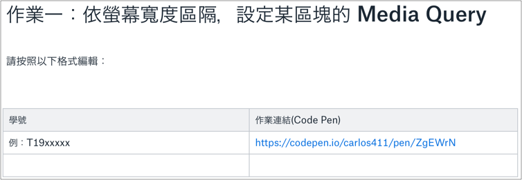

# 1.2 課程簡介

第一、二天：學習 RWD 相關及 Bootstrap。 

第三天：QA 及練習。

## 什麼是 Responsive Web Design？

又稱做 **RWD**，中譯：響應式設計。  
不論任何裝置：桌上型電腦、平板、手機都有著不同的螢幕大小。為了解決在同一份網頁面對這些設備，有不同的版面情況、使用情境，因此 RWD 誕生。一切都是為了提供使用者有更好的使用體驗\(User Experience\)：**易讀性**、**操控性**。

技術思維：在一個 **HTML** 頁面，使用同一份 **CSS**，在不同的裝置呈現時，都能正常呈現且維持良好的體驗。

## 誰該學習這門課程？

* 對網站前端工程領域有興趣。
* 已經學習過基礎的 HTML、CSS，想進一步瞭解 RWD 主題。

## Code Pen 註冊

作業繳交直接貼 CodePen 的網址，所以請同學先註冊：

[https://codepen.io/](https://codepen.io/)

## 編輯器

* [Atom](https://atom.io/)
* [Sublime](https://www.sublimetext.com/)
* [VS Code](https://code.visualstudio.com/)

## 作業繳交方式

### 方式一：直接編輯 Dropbox Paper 文件

需有 Dropbox 帳號來 [編輯文件](https://paper.dropbox.com/doc/DD105-RWD--AqeF8l3baktuXenK1ZQAoEzHAQ-SiBkDioNv74kW5Y1GSkAc)，如果沒有 Dropbox 帳號，可以 [Dropbox 註冊](https://db.tt/orEu7RZK) 或使用方式二\(寄 Email\)。

示意：

### 方式二：寄 email

請按照以下格式寄出 email 至 **chang.abin@gmail.com**

Email 主旨：

**DD105 RWD T19xxxxx 作業一繳交**

內容：

**作業連結：\(Code Pen 網址\)**

