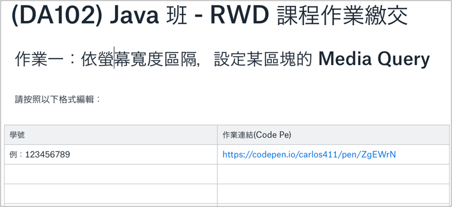

# 作業

## 作業一：依螢幕寬度區隔，設定某區塊的 Media Query

請 fork 以下程式，然後將 `div.my_div1` 區塊水平置中，並將該區塊按照以下 media query 規則設定：

* 瀏覽器寬度 &lt; 576px 時，`div.my_div1` 的寬度設定成 100%。
* 576px &lt;= 瀏覽器寬度 &lt; 768px 時，`div.my_div1` 的寬度設定成 540px。
* 768px &lt;= 瀏覽器寬度 &lt; 992px 時，`div.my_div1` 的寬度設定成 720px。
* 992px &lt;= 瀏覽器寬度 &lt; 1200px 時，`div.my_div1` 的寬度設定成 960px。
* 瀏覽器寬度 &gt;= 1200px 時，`div.my_div1` 的寬度設定成 1140px。

[參考：此規則即 Bootstrap Grid options](https://getbootstrap.com/docs/4.3/layout/grid/#grid-options)

## 作業二

## 作業繳交方式

### 方式一：直接編輯 Dropbox Paper 文件

需有 Dropbox 帳號來編輯 [文件](https://paper.dropbox.com/doc/DA102-Java-RWD--AhJVCPLg7UZYlRQM~lfEPY5PAQ-jwvZqVj0QFh1PnWE5IFRy) 需，如沒有 Dropbox 帳號，可 [Dropbox 註冊\(Refferrals\)](https://db.tt/orEu7RZK) 或使用方式二\(寄 Email\)。

示意：

### 方式二：寄 email

請按照以下格式寄出 email 至 chang.abin@gmail.com

主旨：DA102 RWD 您的學號 作業一繳交

內容：         學號          作業連結

