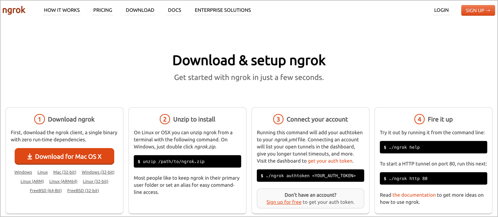
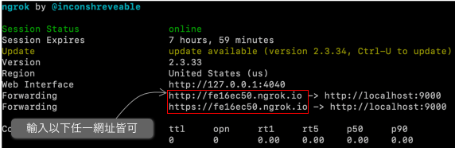

# 使用 ngrok

## ngrok 是什麼？

在本機端開發的時候，我們常常會使用 `http://localhost` 這樣的網址來開發，但問題在實做 RWD 的時候，有時會希望在手機上能實際瀏覽，那就會需要透過 Ngrok 來幫我們達成。

簡而言之，Ngrok 會替我們的本機端網址，產生另一個網址，那我們就讓手機輸入該網址來連線。

## 使用步驟



### 第一步：下載 ngrok 指令檔

至 [ngrok 下載網址](https://ngrok.com/download)，下載解壓縮，會取得一個檔名為 `ngrok` 的檔案，可任意存放在你想存的位置。

### 第二步：路徑切換到 ngrok 所在的目錄

例如：ngrok 所在位置： `/home/ngrok`，ngrok 是一個檔案。

那就執行以下指令：

```bash
$ cd /home
```

### 第三步：使用 ngrok 來產生線上網址

假設有一個本機端網址：`http://localhost:9000`，那就執行以下指令：

```bash
$ ./ngrok http 9000
```

這時就可以看到：



如上圖所示，ngrok 幫我們產生了網址，那我們就可以實際用真實的裝置來測試 RWD 的實際狀況，或任何網頁上的操作。

