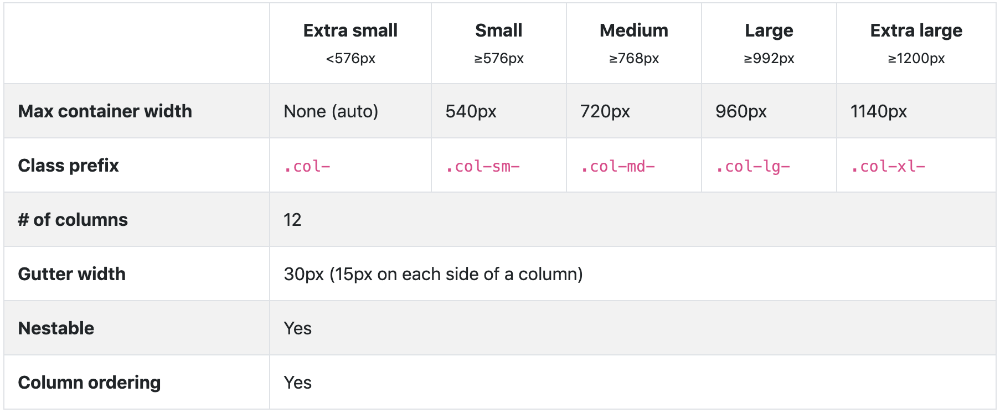

# 佈局 Layout

## 格線系統



## 瞭解樣式 container 和 container-fluid

### container

div 元素加上 container 樣式：

```markup
<div class="container">
</div>
```

這時的 `div.container`，寬度就會如圖一的 `Max container width` 來做變化。  
例：螢幕寬度 &gt;= 1200px 時，`div.container` 的寬度就是 1140px。以此類推。

### container-fluid

div 元素加上 container-fluid 樣式：

```markup
<div class="container-fluid">
</div>
```

這時的 `div.container`，寬度就是 100%。

## 範例 1：sm 範圍以上三欄均分



## 範例 2：各欄寬度自動均分



## 範例 3：設定某欄佔幾欄



## 範例 4：內容決定欄寬

透過 `col-{breakpoint}-auto` 可以將該欄設定成：寬度由內容決定。



## 範例 5：中斷點練習，所有圍範



## 範例 6：中斷點練習，sm 圍範以上



## 範例 7：中斷點練習，同時設定所有範圍及 md 範圍以上



## 範例 8：改變預設的 Gutters

先理解 [Spacing 規則](https://getbootstrap.com/docs/4.3/utilities/spacing/)。

* {property}{sides}-{size} 用於 xs。
* {property}{sides}-{breakpoint}-{size} 用於 sm, md, lg, and xl 這幾個 breakpoint。

property 代號：

* **m**：表示 margin。
* **p**：表示 padding

sides 代號：

* **t**：表示設定 margin-top 或 padding-top。
* **b**： 表示設定 margin-bottom 或 padding-bottom。
* **l**：表示設定 margin-left 或 padding-left。
* **r**：表示設定 margin-right 或 padding-right。
* **x**：表示設定 \*-left 和 \*-right。
* **y**：表示設定 \*-top 和 \*-bottom。
* **blank**： 表示設定 margin 或 padding 的四個方向。

size 代號\( $spacer 預設是 1rem \)：

* **0**：設定 margin 或 padding 為 `0`。
* **1**：設定 margin 或 padding 為 `$spacer * 0.25`。
* **2**：設定 margin 或 padding 為 `$spacer * 0.5`。
* **3**：設定 margin 或 padding 為 `$spacer`。
* **4**：設定 margin 或 padding 為 `$spacer * 1.5`。
* **5**：設定 margin 或 padding 為 `$spacer * 3`。
* **auto**：設定 margin 為 `auto`。
* 設定 margin 的時候，以上數值代號前加一個 `n`，就會變成是負數，n 是 Negative 的意思。

### 改變 gutters 的規則

1. 在「**欄**」的部份：改變 `padding-left` 和 `padding-right`。預設 15px。
2. 在「**列**」的部份：改變 `margin-left` 和 `margin-right`。預設 -15px。
3. 在「**container**」的部份：設定 `padding-left` 和 `padding-right`。預設 15px。




參考：實務上未必需要修改。


