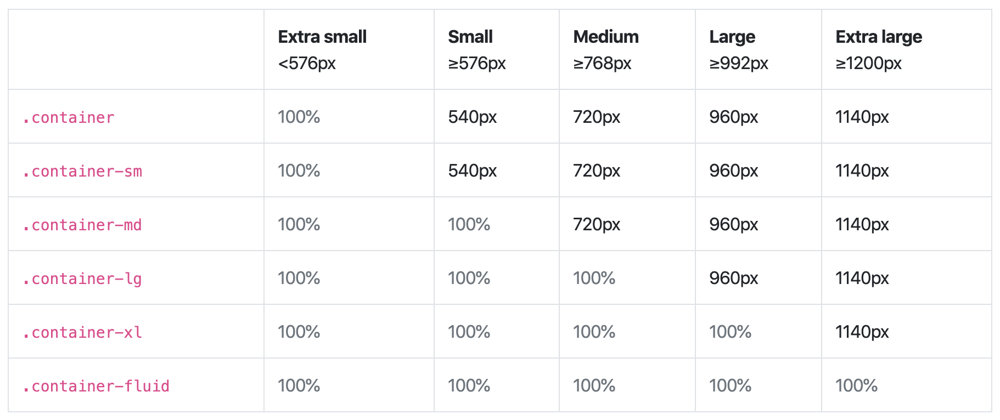

# 佈局 Layout

## 格線系統


記得以下這幾個版面的分界點：

* 576px
* 768px
* 992px
* 1200px

## 瞭解樣式 container 和 container-fluid

### container

div 元素加上 container 樣式：

```markup
<div class="container">
</div>
```

這時的 `div.container`，寬度就會如圖一的 `Max container width` 來做變化。  
例：螢幕寬度 &gt;= 1200px 時，`div.container` 的寬度就是 1140px。以此類推。

### container-fluid

div 元素加上 container-fluid 樣式：

```markup
<div class="container-fluid">
</div>
```

這時的 `div.container-fluid`，寬度就是 100%。

從 4.4.1 版本開始，多了以下規範：



範例[觀察](https://getbootstrap.com/docs/4.4/examples/grid/#containers)。

## 範例 1：指定 sm 範圍以上三欄均分



請試著改成 md 範圍、lg 範圍、xl 範圍，並觀察。

## 範例 2：不論任何範圍，各欄寬度自動均分



也試著將 `container` 改成 `container-fluid` 並觀察。

## 範例 3：不論任何範圍，設定某欄佔幾欄



試著改變所佔的欄數，例如將 `col-5` 改成 `col-8`。\(改成佔8欄\)

## 範例 4：指定特定圍圍，由內容決定欄寬

透過 `col-{breakpoint}-auto` 可以將該欄設定成：寬度由內容決定。



## 範例 5：分界點練習，所有範圍



試著新增一個列\(row\)，不論任何範圍，各佔 3 欄及 7 欄。

## 範例 6：分界點練習，sm 範圍以上



試著新增一個列，在 xl 範圍\(1200px 以上\)，兩個欄位，各佔 4 欄及 8 欄。

## 範例 7：分界點練習，同時設定所有範圍及 md 範圍以上



試著新增一個列，設定多個範圍併用。

## 範例 8：垂直方向對齊方式 1

在「列」中，加上以下樣式：

* align-items-start
* align-items-center
* align-items-end



瞭解範例8及9的對齊方式。

## 範例 9：垂直方向對齊方式 2

在「欄」中，加上以下樣式：

* align-self-start
* align-self-center
* align-self-end



瞭解範例8及9的對齊方式。

## 範例 10：水平方向對齊方式

在「列」中放入以下樣式：

* justify-content-start
* justify-content-center
* justify-content-end
* justify-content-around
* justify-content-between



瞭解水平對齊方式。

## 範例 11：欄的位移

語樣：offset-{breakpoint}-{number}



試著新增一列，在 xl 範圍有三個欄位，各佔2、2、2欄，最後一個位移6欄。其它範圍各欄均分。

## 範例 12：將 row 用在其它 div

關於 margin 負邊界：



將 Bootstrap 的 row 用在其它 div：




結論：

* `.row` 可以運用在任何地方，不一定要放在 `.container` 或 `.container-fluid` 裡面。
* 包住 div.row 的 div，設定 `padding-left: 15px`、`padding-right: 15px` 即可。

## 練習1

指定檔名：`bs_grid1.html`

建立一個 div.container 元素：

* 裡面的一個列，分成三個內容區塊，每個內容區塊在 md 範圍以上佔四欄，在 md 圍範以下，每個內容區塊都佔 12 欄。
* 每個內容區塊放一張暫時性的圖，參考 [placeholder.com](https://placeholder.com/)

## 練習2

指定檔名：`bs_grid2.html`

暫時性的假圖參考：[picsum](https://picsum.photos/)。

建立第一個 div.container 元素：

* 裡面的一個列，兩個內容區塊，不管在任何螢幕區間，各佔 6 欄，且內容區塊都是正方形。左側區塊放一張佔滿的背景圖，右側區塊輸入簡短的標題。

緊接著再建立一個 div.container-fluid 元素：

* 放一張佔滿的背景圖。

緊接著再建立一個 div.container 元素：

* 裡面的一個列，兩個內容區塊，不管在任何螢幕區間，各佔 6 欄，且內容區塊都是正方形。左側區塊輸入簡短的標題，右側區塊放一張佔滿的背景圖。

## 練習3

指定檔名：`bs_grid3.html`。

建立一個 div.container-fluid 元素：

* 裡面的一個列，一個內容區塊，在 sm 範圍以上佔 8 欄，且需向右位移 2 欄以達成置中。在 sm 範圍以下則佔 12 欄，不需位移。
* 上述的內容區塊，需再增加一個列，分成左右兩個區塊，不管任何螢幕範圍，都是各佔 6 欄，內容區塊輸入任意內容皆可。

