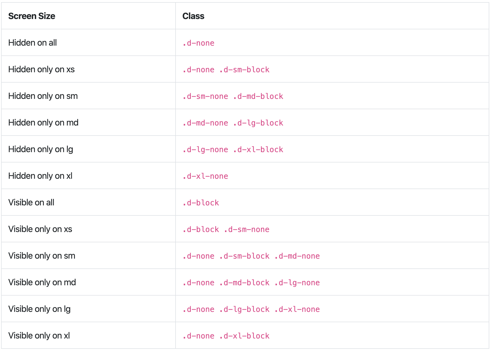

# 9.6 工具 Utilities

官方 [Utilities 頁面](https://getbootstrap.com/docs/4.4/utilities/borders/)

## Close icon

```markup
<button type="button" class="close">
  <span>&times;</span>
</button>
```



## Visibility

瀏覽 [Bootstrap 的 Visibility](https://getbootstrap.com/docs/4.4/utilities/visibility/) 相關 class。只有兩個 class。

* visible
* invisible

範例：




## Display 中的 元素隱藏與否



例：.d-lg-none .d-xl-block

lg 的範圍是992px 以上，所以 992px 以上都會隱藏；  
但xl以上又變成是 block，所以 1200px 以上會出現。  
所以真正會隱藏的範圍會是 992px ~ 1199px 。



欄的隱藏與切換：




實際案例\( [5breakfast](https://5breakfast.com/) \)：


