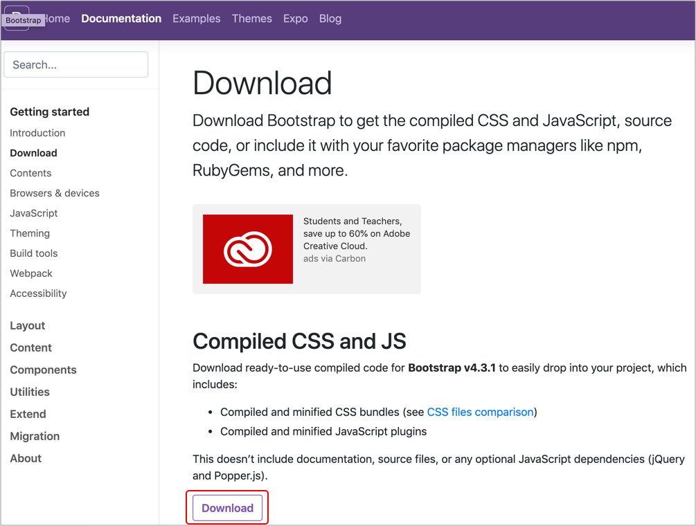
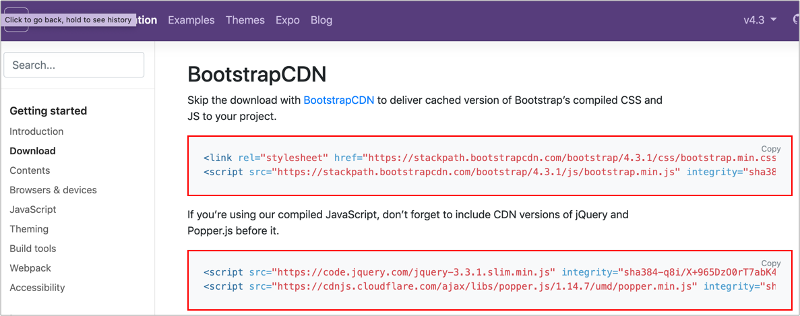

# 如何使用 Bootstrap

## 方式一：下載 Bootstrap

進到 [下載頁面](https://getbootstrap.com/docs/4.3/getting-started/download/)，如下圖，點選 Download，如下圖：



下載之後，找到以下兩個檔案，網頁載入：

* css/bootstrap.min.css
* js/bootstrap.min.js

### 相依性

使用 Boostrap，還需要載入其它函式庫，才能使用，依照官方說明：

This doesn’t include documentation, source files, or any **optional JavaScript dependencies \(jQuery and Popper.js\)**.

實測結果，jQuery 一定要載入，這裡將 [jQuery](https://jquery.com/) 及 [Popper](https://popper.js.org/) 一起載入。直接提供這兩個的原始碼：

* [jquery-3.4.1.min.js](https://code.jquery.com/jquery-3.4.1.min.js)
* [popper.min.js](https://cdnjs.cloudflare.com/ajax/libs/popper.js/1.14.7/umd/popper.min.js)

所以最後全部順利載入的原始碼如下：

```markup
<!-- Bootstrap 的 CSS -->
<link rel="stylesheet" href="./vendors/bootstrap/css/bootstrap.min.css">

<!-- Bootstrap 的 JS 及相依性安裝(jQuery、Popper) -->
<script src="./vendors/jquery/jquery-3.4.1.min.js"></script>
<script src="./vendors/popper/popper.min.js"></script>
<script src="./vendors/bootstrap/js/bootstrap.min.js"></script>
```

## 方式二：直接使用 CDN



