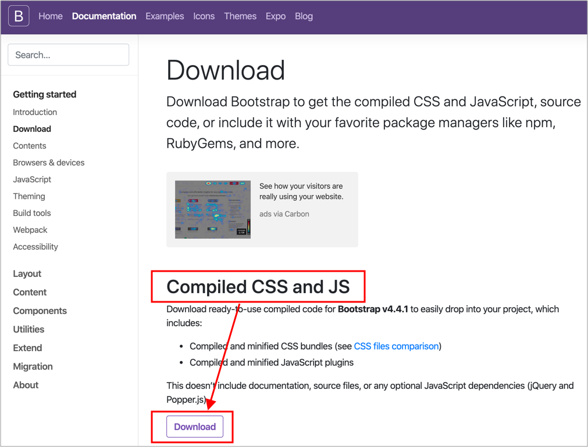
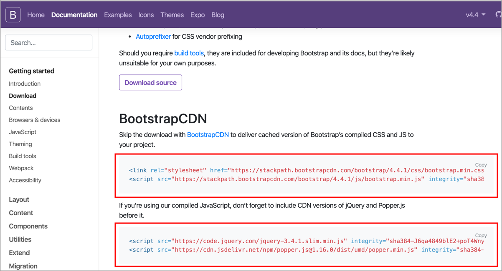
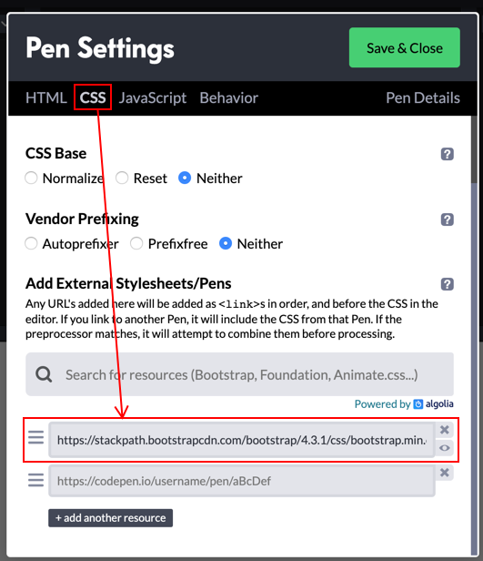
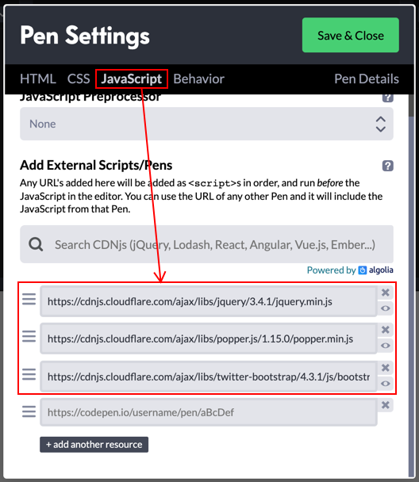

# 9.2 如何使用 Bootstrap

## 方式一：下載 Bootstrap

進到 [下載頁面](https://getbootstrap.com/docs/4.4/getting-started/download/)，如下圖，點選 Download，如下圖：



下載之後，找到以下兩個檔案，網頁載入：

* css/bootstrap.min.css
* js/bootstrap.min.js

### 相依性

使用 Boostrap，還需要載入其它函式庫，才能使用，依照官方說明：

This doesn’t include documentation, source files, or any **optional JavaScript dependencies \(jQuery and Popper.js\)**.

實測結果，jQuery 一定要載入，這裡將 [jQuery](https://jquery.com/) 及 [Popper](https://popper.js.org/) 一起載入。直接提供這兩個的原始碼：

* [jquery-3.4.1.min.js](https://code.jquery.com/jquery-3.4.1.min.js)
* [popper.min.js](https://cdn.jsdelivr.net/npm/popper.js@1.16.0/dist/umd/popper.min.js)

所以最後全部順利載入的原始碼如下：

```markup
<!DOCTYPE html>
<html>
  <head>

    <!-- Bootstrap 的 CSS -->
    <link rel="stylesheet" href="./vendors/bootstrap/css/bootstrap.min.css">
  
  </head>
  <body>
  
    <!-- 其它 html -->

        
    <!-- body 結束標籤之前，載入Bootstrap 的 JS 及其相依性安裝(jQuery、Popper) -->
    <script src="./vendors/jquery/jquery-3.4.1.min.js"></script>
    <script src="./vendors/popper/popper.min.js"></script>
    <script src="./vendors/bootstrap/js/bootstrap.min.js"></script>
  </body>
</html>
```

[下載已安裝好 Bootstrap 的資料夾範例](http://notes.carlos-studio.com/download/bootstrap_installed_sample.zip)

## 方式二：直接使用 CDN



將上圖 CDN 所提供的路徑載入，如下原始碼：

```markup
<!DOCTYPE html>
<html>
  <head>

    <!-- Bootstrap 的 CSS -->
    <link rel="stylesheet" href="https://stackpath.bootstrapcdn.com/bootstrap/4.4.1/css/bootstrap.min.css" integrity="sha384-Vkoo8x4CGsO3+Hhxv8T/Q5PaXtkKtu6ug5TOeNV6gBiFeWPGFN9MuhOf23Q9Ifjh" crossorigin="anonymous">
    
  </head>
  <body>
  
    <!-- 其它 html -->
        
    <!-- body 結束標籤之前，載入Bootstrap 的 JS 及其相依性安裝(jQuery、Popper) -->
    <script src="https://code.jquery.com/jquery-3.4.1.slim.min.js" integrity="sha384-J6qa4849blE2+poT4WnyKhv5vZF5SrPo0iEjwBvKU7imGFAV0wwj1yYfoRSJoZ+n" crossorigin="anonymous"></script>
    <script src="https://cdn.jsdelivr.net/npm/popper.js@1.16.0/dist/umd/popper.min.js" integrity="sha384-Q6E9RHvbIyZFJoft+2mJbHaEWldlvI9IOYy5n3zV9zzTtmI3UksdQRVvoxMfooAo" crossorigin="anonymous"></script>
    <script src="https://stackpath.bootstrapcdn.com/bootstrap/4.4.1/js/bootstrap.min.js" integrity="sha384-wfSDF2E50Y2D1uUdj0O3uMBJnjuUD4Ih7YwaYd1iqfktj0Uod8GCExl3Og8ifwB6" crossorigin="anonymous"></script>
  </body>
</html>
```

## 方式三：在 CodePen 中使用

將上述的「方式二」提供的四個 CDN 連結，放入到下圖：

步驟 Settings → CSS → JS → Save & Close，如下圖：





