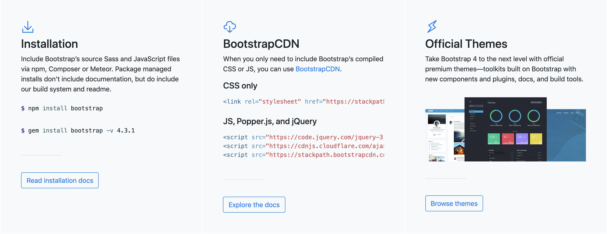
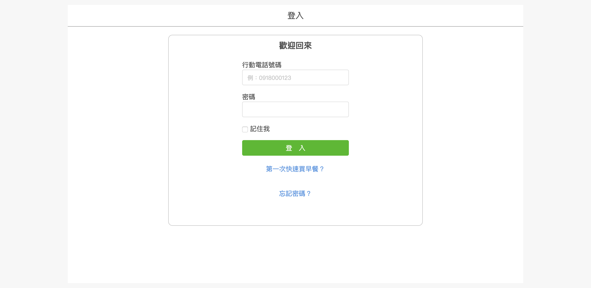

# 版面概念解析

## Fixed：固定式


概念：版面是固定寬度，不論螢幕寬度如何，都不會影響版面大小。


案例參考：[王爺水餃子](http://www.wangye99.idv.tw/)

## Fluid：流體式


概念：版面寬度是用百分比來佔比例，螢幕在縮放時，版面會跟隨螢幕來縮放。


例：[Bootstrap 官網](https://getbootstrap.com/)的下圖區域：

## Adaptive：自適性


概念：鎖定幾個螢幕寬度尺吋，來決定版面主內容應該改變成多少固定尺吋。


例如：

* 針對螢幕寬度 1920px，版面主內容區塊 1600px。
* 針對螢幕寬度 1599px，版面主內容區塊 1440px。
* 針對螢幕寬度 1439px，版面主內容區塊 1200px。 
* 針對螢幕寬度 1199px ，版面主內容區塊 992px。
* 針對螢幕寬度 991px，版面主內容區塊 768px。
* 針對螢幕寬度 767px，版面主內容區塊 576px。
* 針對螢幕寬度 575px，版面主內容區塊 100%。

案例：[5breakfast 登入頁面](https://5breakfast.com/login) 的登入區域，如下圖：

## Responsive：響應式


概念：不論使用者用的螢幕裝置為何\(桌機、平板、手機等\)，版面要能夠自動的調整，以維持易讀性、易用性，讓使用者能夠正常的使用、操作。


案例參考：[Sabina Journal](https://sabinahuang.com/)

## 重要觀念

* 以上概念，並非是擇一使用，通常一個網頁當中，是這些概念的混用，以達成我們要呈現給使用者的介面。
* 介面的好壞，並非由你、設計師、工程師決定。而是由用戶決定\(~~雖然大部份的情況可能是 Boss 決定~~\)，需要經過數據，來做分析介面流程的決策。未來的研究：[A/B Test](https://support.google.com/optimize/answer/6211930?hl=en&ref_topic=6197696) 。

## 範例觀察



