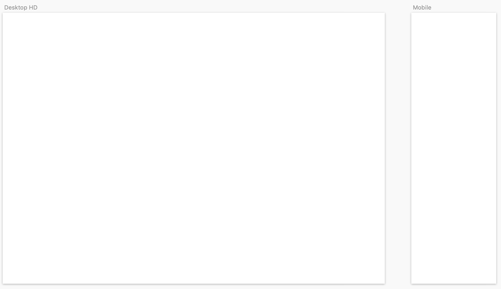
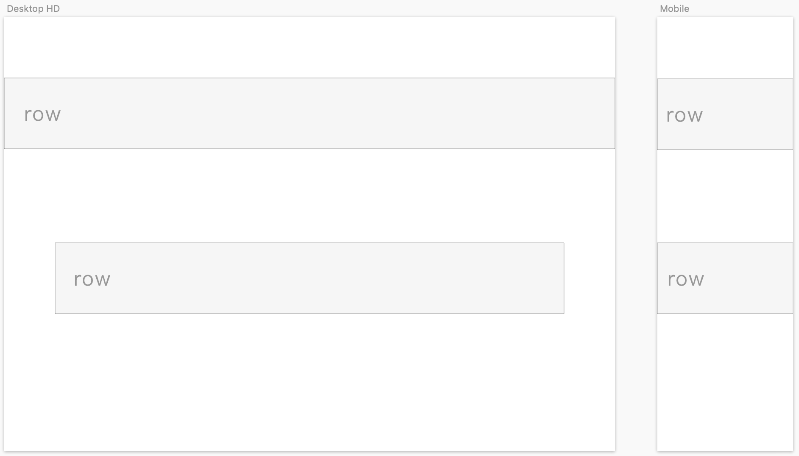
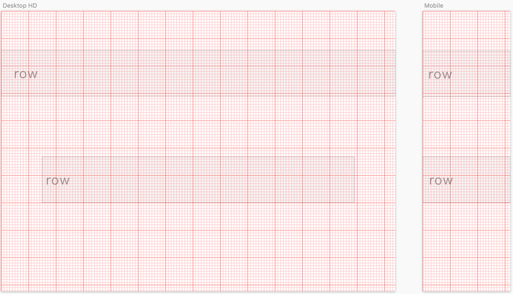
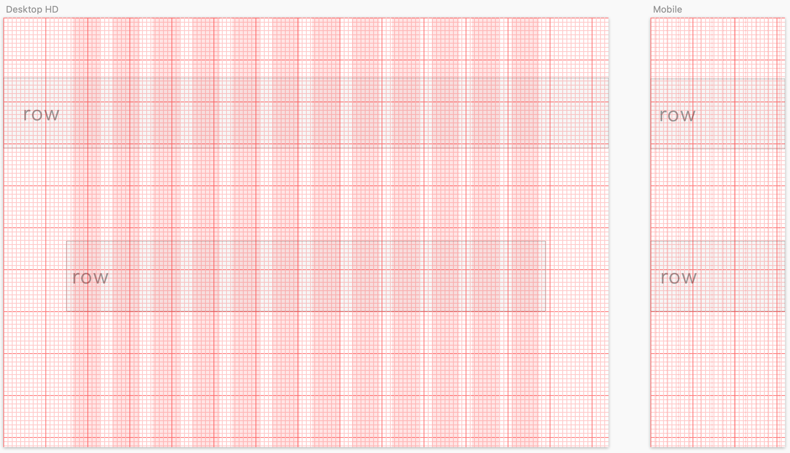

# 觀念理解

## 格線系統概念

第一步：桌機版、行動版空白頁面：

第二步：任何結構區塊\(下圖以滿版為例\)，都視為列\(row\)：

* row 可以出現在頁面任何位置。
* row 的寬度可以是固定寬、或某百分比。
* row 的高度通常依內容來決定。

第三步：顯示網格\(Grid\)

* 每一個小紅框都是寬高 10px。

第四步：任何的列\(row\)，都有自己的 12 個欄位

* 這 12 個欄位，各欄位之間都有固定的間隔\(Gutter\)。
* 間隔\(Gutter\)是由左右 padding 所創造。
* 假設以使用 Bootstrap 為例，間隔\(Gutter\)是 30px，也就是各欄的 padding-left、padding-right 都各是 15px。

## 重點整理

* 不論行動版、桌機版都保有一致性的格線系統。
* 格線系統可運用在任何的寬度、位置。
* 理解列\(Row\)、欄\(Column\)、間隙\(Gutter\)。

