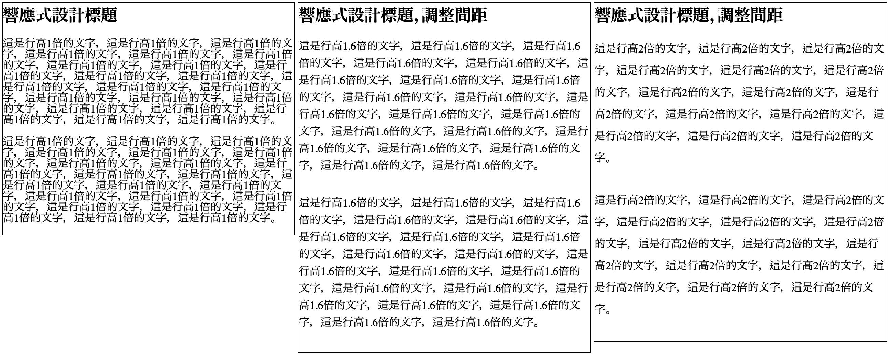

# 縱向文字間距

## 相關的 CSS

* margin-top、padding-top
* margin-bottom、padding-bottom
* line-height

## 原則

* 有足夠的空間\(留白\)，讓文字可以呼吸\(提高易讀性\)。
* 在整個頁面當中，保有一致性的間距。\(例：行高一致性\)。

## 範例：縱向文字間距

[Code Pen：縱向文字間距](https://codepen.io/carlos411/pen/gNJmJd)



