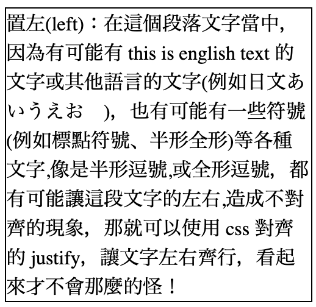
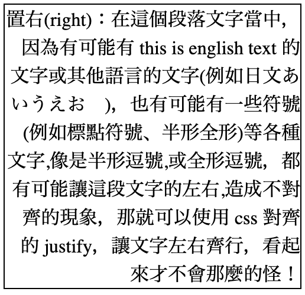
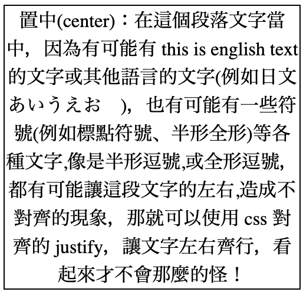
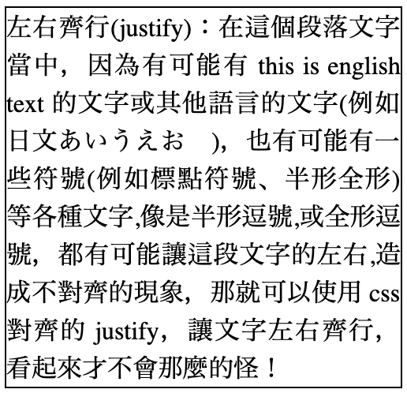

# 文字對齊

## 置左對齊

```css
text-align: left;
```



## 置右對齊

```css
text-align: right;
```



## 置中對齊

```css
text-align: center;
```



## 左右齊行

```css
text-align: justify;
```




justify 左右齊行，實際使用情況較少，因為會造成中間的字距有的寬、有的窄，所以請斟酌使用。


## Code Pen 工具介紹

範例：[https://codepen.io/carlos411/pen/MMxWwz](https://codepen.io/carlos411/pen/MMxWwz)

可隨意更改原始碼，請放心，不會影響到原作者的版本。如有註冊 Code Pen 帳號之後，可以透過 Fork 功能，將原始碼完整複製一份至您的帳號底下，以便留存、測試。

