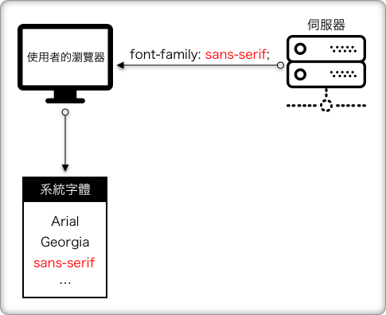

# 字體

## 網頁安全字體 Web Safe Fonts

在早期，瀏覽器並沒有能夠提供將字體傳送給瀏覽器然後使用的這個方式，都只能依賴使用者本機端電腦預先安裝好的字體來使用，這些字體，我們俗稱網頁安全字體\(Web Safe Fonts\)。

概念如下圖一：

​如果網頁要使用其他特殊字體的話，該怎麼辦？沒有辦法，只能請設計師輸出成圖片，然後使用 `` 標籤來在網頁上呈現。這實在非常的麻煩。

## 自行定義網頁字體 Custom Web Fonts

幸好，隨著瀏覽器的日益更新，開始支援了自訂網頁字體，也就是我們開發人員，可以透過 CSS 的 `@font-face` 語法，來告訴瀏覽器，去某伺服器下載字體吧。很讚。

概念如下圖二：

但…依然出現了一個問題，就是每個瀏覽器所支援的字體格式不同……仍令人困擾。

## 字體格式

目前常看到的字體格式有以下幾種：

| 字體格式檔案的副檔名 | 瀏覽器 |
| :--- | :--- |
| .svg | Safari |
| .eot | IE |
| .ttf | 除了 IE 之外 |
| .woff | 較新的瀏覽器 |
| .woff2 | 是 .woff 的新版，檔案較小，效能佳 |

因為瀏覽器接受的字體格式不同的原因，所以會面臨到要為不同的瀏覽器，準備不同的字體格式檔。

概念如下圖：

其中 WOFF、WOFF2 字體格式是目前最新且也被廣泛支援於所有新瀏覽器當中。

